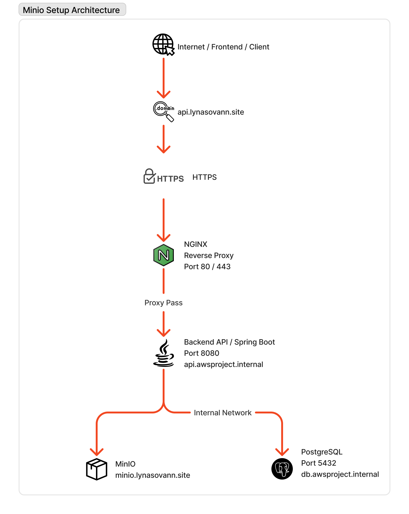

# API Reverse Proxy EC2 Instance Setup

This section describes how an **NGINX reverse proxy** is deployed on a dedicated EC2 instance to securely expose the **Spring Boot backend API** to the internet.
The reverse proxy handles:

- HTTPS termination using **Let's Encrypt**
- **HTTP → HTTPS redirection**
- **Forwarding requests to the internal backend API service**
  The backend API itself runs on a **separate EC2 instance** and is only accessible through the internal network.

## Architecture Overview



### Request Flow

1. A client sends a request to `https://api.lynasovann.site`.
2. DNS resolves the domain to the **API Reverse Proxy EC2 instanc**.
3. **NGINX** receives the request on **port 443 (HTTPS)**.
4. NGINX forwards the request to the **backend API service** running at: `api.awsproject.internal:8080`.
5. The **Spring Boot backend** processes the request.
6. The backend communicates with:
   - **PostgreSQL** for database operations.
   - **MinIO** for object storage.
7. The response is returned through:
   `Backend → NGINX Reverse Proxy → Client`

---

## EC2 Instance Configuration

| Setting        | Value                     |
| -------------- | ------------------------- |
| Instance Name  | `awsproject-api-rp`       |
| AMI            | Ubuntu Server 24.04       |
| Instance Type  | `t2.micro`                |
| Key Pair       | `awsproject-prod-key.pem` |
| Security Group | `awsproject-api-nginx-SG` |

---

## Instance Access

- SSH Into Instance

```bash
ssh -i awsproject-prod-key.pem ubuntu@<public-ip-address>
```

- Switch to Root User

```bash
sudo -i
```

---

## Install and Configure NGINX

- Update package index

```bash
apt update -y
```

- Install Nginx

```bash
apt install -y nginx
```

- Enable Nginx to start on boot

```bash
systemctl enable nginx
```

- Start Nginx service

```bash
systemctl start nginx
```

- Verify Service Status

```bash
systemctl status nginx
```

---

## SSL Configuration (Let's Encrypt)

- Install **Certbot** and **NGINX** Plugin

```bash
apt install certbot python3-certbot-nginx -y
```

- Generate SSL Certificate

```bash
certbot --nginx -d api.lynasovann.site
```

---

## Configure NGINX Reverse Proxy

- Create the configuration file:

```bash
/etc/nginx/sites-available/api.lynasovann.site
```

- Configuration

```bash
upstream api_backend {
    server api.awsproject.internal:8080;
}

# Redirect HTTP → HTTPS
server {
    listen 80;
    server_name api.lynasovann.site;

    return 301 https://$host$request_uri;
}

# HTTPS server
server {
    listen 443 ssl;
    server_name api.lynasovann.site;

    ssl_certificate /etc/letsencrypt/live/api.lynasovann.site/fullchain.pem;
    ssl_certificate_key /etc/letsencrypt/live/api.lynasovann.site/privkey.pem;

    location / {
        proxy_pass http://api_backend;
        proxy_http_version 1.1;

        proxy_set_header Host $host;
        proxy_set_header X-Real-IP $remote_addr;
        proxy_set_header X-Forwarded-For $proxy_add_x_forwarded_for;
        proxy_set_header X-Forwarded-Proto $scheme;
    }
}
```

- Enable NGINX Site Configuration

```bash
ln -s /etc/nginx/sites-available/api.lynasovann.site /etc/nginx/sites-enabled/api.lynasovann.site
```

- Apply configuration

```bash
systemctl restart nginx
```

- Verify Service

```bash
systemctl status nginx
```

### ✅ Result:

- The **API Reverse Proxy** securely exposes the backend service at:`https://api.lynasovann.site`.
- HTTPS is enabled using **Let's Encrypt SSL certificates**.
- All incoming requests are forwarded to the **internal backend API instance**.
- The backend service remains **private and protected within the internal AWS network**.
