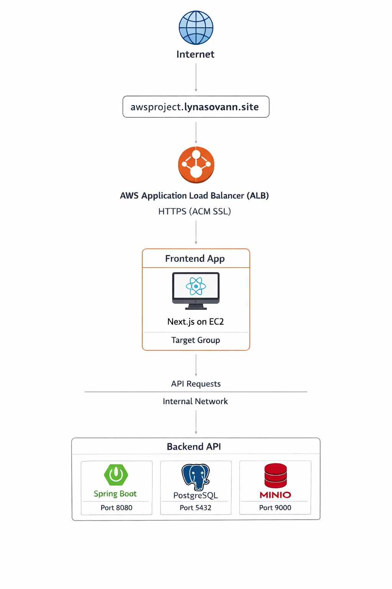

# Frontend (Next.js) EC2 Instance Setup

This section describes how the **Next.js frontend application** is deployed on an EC2 instance and exposed to the internet using **AWS Application Load Balancer (ALB)** with **AWS Certificate Manager (ACM)** for HTTPS.
The frontend communicates with the backend API via:
`https://api.lynasovann.site`

## Architecture Overview



### Request Flow

1. A user accesses the frontend application through the domain: **https://awsproject.lynasovann.site**.
2. DNS resolves the domain to the **AWS Application Load Balancer**.
3. The **ALB terminates HTTPS using an AWS ACM certificate**.
4. The ALB forwards the request to the **frontend EC2 instance** through a **Target Group**.
5. The **Next.js application** processes the request and serves the frontend content.
6. The frontend sends API requests to: `https://api.lynasovann.site`.
7. The API Reverse Proxy forwards those requests to the **Spring Boot backend service**.

---

## EC2 Instance Configuration

| Setting          | Value                     |
| ---------------- | ------------------------- |
| Instance Name    | `awsproject-app`          |
| AMI              | Ubuntu Server 24.04       |
| Instance Type    | `t3.micro`                |
| Key Pair         | `awsproject-prod-key.pem` |
| Security Group   | `awsproject-app-SG`       |
| User Data Script | `./userdata/nextjs.sh`    |

---

## Instance Access

- SSH Into Instance

```bash
ssh -i awsproject-prod-key.pem ubuntu@<public IP address>
```

- Switch to Root User

```bash
sudo -i
```

---

## Setup Node (22+) and yarn

- Run the setup script provided in the userdata folder:

```bash
./userdata/setup-node.sh
```

This will install **Node** and Yarn for building the frontend project.

---

## Deploy the Frontend Project

- Clone the Repository

```bash
cd /opt/frontend
git clone https://github.com/LynaSovann/frontend-for-testing.git .
```

- Configure Environment Variables, edit the `.env` file:

```bash
vim .env
```

Configuration:

```bash
NEXT_PUBLIC_API_URL=https://api.lynasovann.site
```

---

### Install Dependencies and Build

```bash
/usr/local/node/bin/yarn
/usr/local/node/bin/yarn build
```

---

### Manage Frontend Service

- Restart the frontend service:

```bash
systemctl restart frontend
```

- Check the status

```bash
systemctl status frontend
```

---

## Create Application Target Group

The **Target Group** routes traffic from the **Application Load Balancer** to the frontend EC2 instance.
  

### Result


---

## Create Application Load Balancer

The **Application Load Balaner (ALB)** distributes incoming traffic to the frontend instance.
    

### Result


---

## Configure Domain Name

The domain is configured in **GoDaddy DNS** to point to the **AWS Application Load Balancer**.


---

## Auto Scaling Group

// In progress
The **Auto Scaling Group (ASG)** will automatically scale the frontend EC2 instances based on traffic demand.
This ensures:

- High availability
- Automatic scaling
- Fault tolerance

---

### ✅ Result

The frontend application is successfully deployed and accessible through the domain.

```bash
awsproject.lynasovann.site
```


