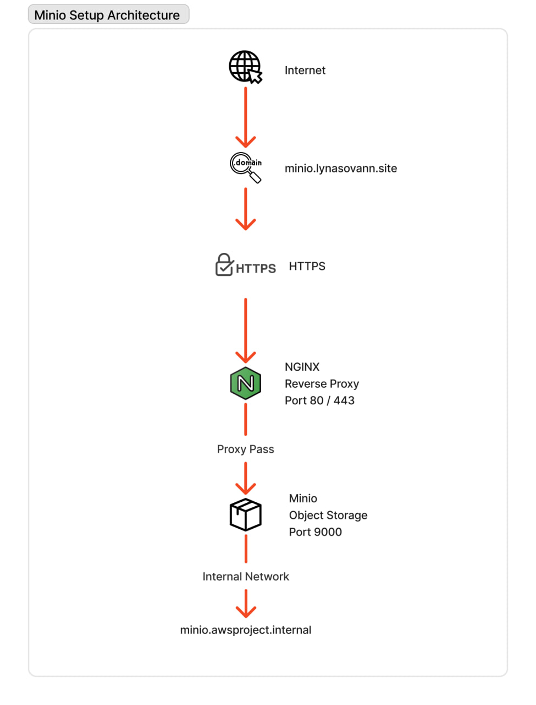

# MinIO EC2 Instance Setup

This section describes how the **MinIO Object Storage service** is deployed on an EC2 instance and exposed securely through **NGINX reverse proxy with HTTPS**

## Architecture Overview



### Request Flow

1. A user accesses **https://minio.lynasovann.site**
2. DNS resolves the domain to the **MinIO EC2 public IP**
3. NGINX recieves the HTTPS request
4. NGINX forwards the request to **MinIO backend (port 9000)**
5. MinIO processes the request and returns the response

---

## EC2 Instance Configuration

| Setting          | Value                     |
| ---------------- | ------------------------- |
| Instance Name    | `awsproject-minio`        |
| AMI              | Ubuntu Server 24.04       |
| Instance Type    | `t2.micro`                |
| Key Pair         | `awsproject-prod-key.pem` |
| Security Group   | `awsproject-minio-SG`     |
| User Data Script | `./userdata/minio.sh`     |

---

## Instance Access

- SSH Into Instance

```bash
ssh -i awsproject-prod-key.pem ubuntu@<public-ip-address>
```

- Switch to Root User

```bash
sudo -i
```

---

## NGINX Setup

NGINX is used as a **reverse proxy** to expose the MinIO service through a public domain and provide **TLS encryption**.

- Update package index

```bash
apt update -y
```

- Install Nginx

```bash
apt install -y nginx
```

- Enable Nginx to start on boot

```bash
systemctl enable nginx
```

- Start Nginx service

```bash
systemctl start nginx
```

- Verify Service Status

```bash
systemctl status nginx
```

---

## SSL Configuration (Let's Encrypt)

- Install **Certbot** and **NGINX** Plugin

```bash
apt install certbot python3-certbot-nginx -y
```

- Generate SSL Certificate

```bash
certbot --nginx -d minio.lynasovann.site
```

This command:

- Requests a certificate from **Let's Encrypt**
- Automatically configures NGINX HTTPS

---

## NGINX Reverse Proxy Configuration

- Create the configuration file:

```bash
/etc/nginx/sites-available/minio.lynasovann.site
```

- Configuration

```bash
# Upstream MinIO backend
upstream minio_backend {
    server minio.awsproject.internal:9000;   # MinIO VM internal IP
}

# Redirect HTTP → HTTPS
server {
    listen 80;
    server_name minio.lynasovann.site;

    return 301 https://$host$request_uri;
}

# HTTPS server
server {
    listen 443 ssl http2;
    server_name minio.lynasovann.site;

    ssl_certificate /etc/letsencrypt/live/minio.lynasovann.site/fullchain.pem;
    ssl_certificate_key /etc/letsencrypt/live/minio.lynasovann.site/privkey.pem;

    # Strong SSL
    ssl_protocols TLSv1.2 TLSv1.3;
    ssl_ciphers HIGH:!aNULL:!MD5;
    ssl_prefer_server_ciphers on;
    ssl_session_cache shared:SSL:10m;

    location / {
        proxy_pass http://minio_backend;
        proxy_set_header Host $host;
        proxy_set_header X-Real-IP $remote_addr;
        proxy_set_header X-Forwarded-For $proxy_add_x_forwarded_for;
        proxy_set_header X-Forwarded-Proto $scheme;
    }
}
```

- Enable NGINX Site

```bash
ln -s /etc/nginx/sites-available/minio.lynasovann.site /etc/nginx/sites-enabled/minio.lynasovann.site
```

- Apply configuration

```bash
systemctl restart nginx
```

- Verify Service

```bash
systemctl status nginx
```

### ✅ Result:

- Minio is accessible via

```bash
https://minio.lynasovann.site
```

- Traffic is encrypted using **TLS**
- NGINX acts as a **secure reverse proxy**
- Backed MinIO remains **internal and protected**
