# Production-Ready AWS Deployment (EC2 + ALB + ASG + S3)

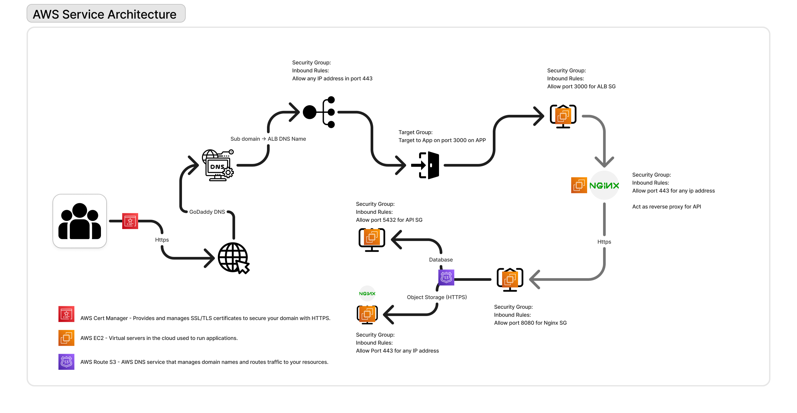

## Project Overview

This project demonstrates a **real-world enterprise-style deployment** on aws using traditional virtual machines (EC2), without Docker and Kubernetes.

The architecture focuses on:

- High availability
- Scalability
- Secure networking
- Proper DNS configuration
- HTTPS encryption
- Controlled access to cloud resources

## Infrastructure Components

- EC2 (Application & Services)
- Application Load Balancer (ALB)
- Auto Scaling Group (ASG)
- Route 53 (Private DNS for Internal Communication)
- GoDaddy (Public Domain DNS)
- SSL Certificate (AWS Certificate Manager)
- Security Groups
- HTTPS (SSL Termination at Load Balancer)

## AWS Setup Flow

### 1. Create Key Pair

- Generate a Key Pair to allow SSH access to your EC2 instances. **awsproject-prod-key.pem**

### 2. Generate Security Groups

Here are the Security Groups created for the project and their purpose:

- **awsproject-ALB-SG** - Controls traffic to the Applciation Load Balancer (ALB), allowing users to access the frontend.
  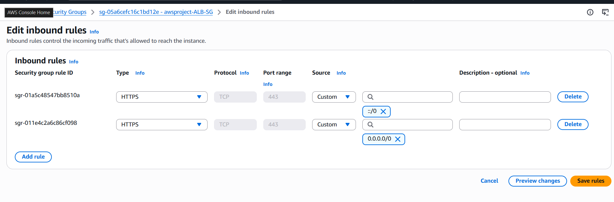

- **awsproject-app-SG** - Assigned to the Frontend EC2 instance. Allows incoming traffic from the ALB.
  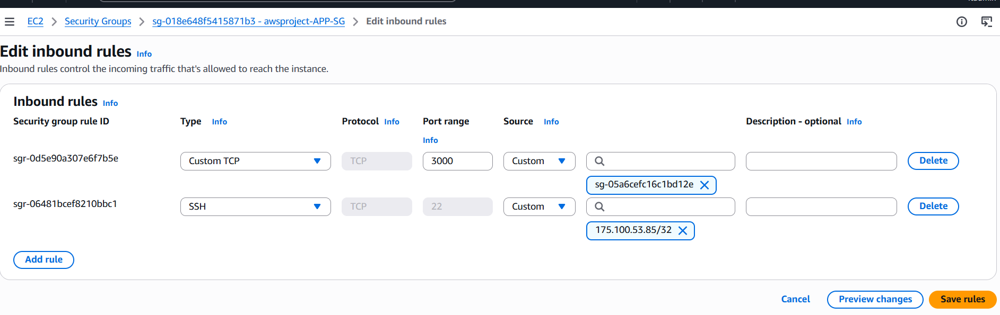

- **awsproject-api-SG** - Assigned to the API EC2 instance. Allows traffic from the Nginx reverse proxy.
  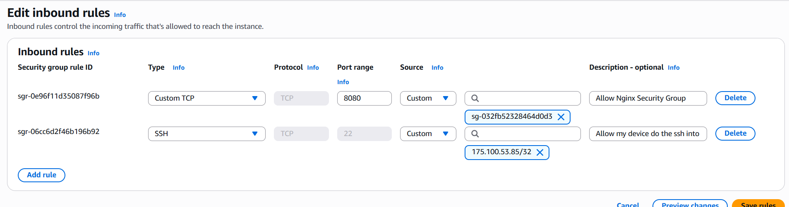
  - **awsproject-api-nginx-sg** - For the Nginx reverse proxy in front of the API. Allows external requests and forwards them to the API instance.
    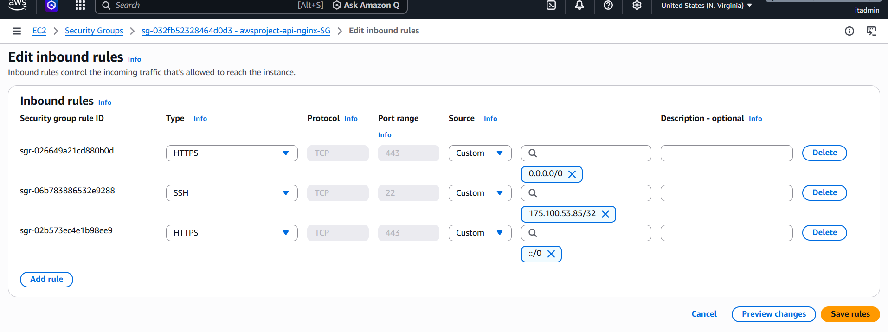

- **awsproject-backend-SG** - For the PostgreSQL database instance. Only allows connections from the API service.
  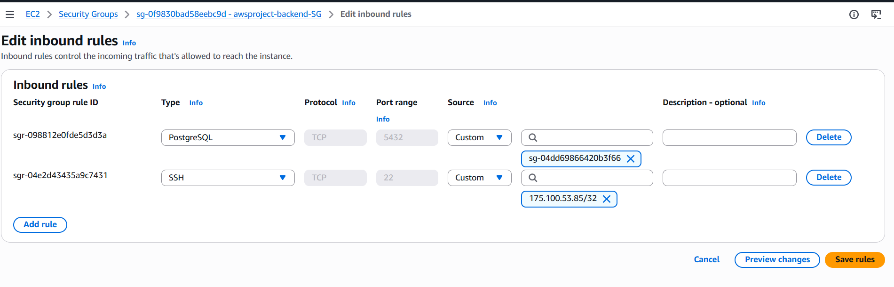

- **awsproject-minio-SG** - Assigned to the Minio instance. Allows traffic from any services that need object storage access.
  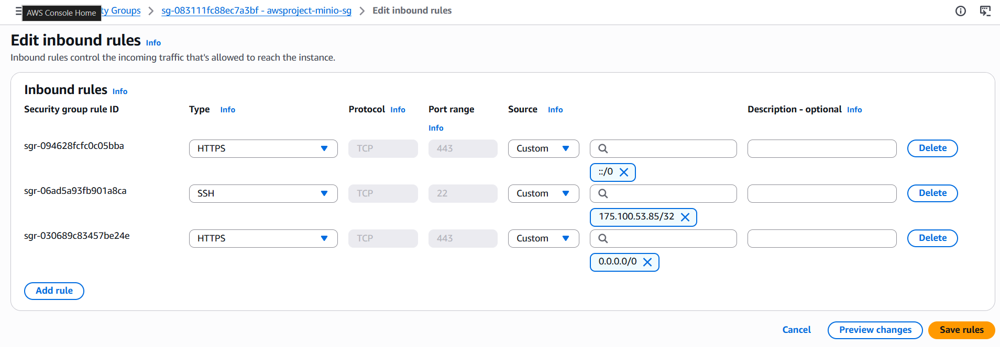

### 3. Launch EC2 Instances

- **awsproject-app** - Hosts the frontend.
- **awsproject-api** - Hosts the api service.
- **awsproject-api-nginx** - Acts as reverse proxy for api service.
- **awsproject-db** - Postgresql database server.
- **awsproject-minio** - Minio server.

---

**awsproject-minio**

- Name: awsproject-minio
- Key Pair: awsproject-prod-key.pem
- Security Group: awsproject-minio-SG
- API: Ubuntu Server 24.04 , t2.micro
- user data: **./userdata/minio.sh**
- After Launch the instance

1. SSh to instance

```bash
ssh -i .\awsproject-prod-key.pem ubuntu@<public-ip-address>
```

2. Switch to root user

```bash
sudo -i
```

3. Install Nginx and request certificate for domain name **minio.lynasovann.site** for ssl

- Command line in file <./ingx/nginx.sh>

**awsproject-db**

- Name: awsproject-db
- Key Pair: awsproject-prod-key.pem
- Security Group: awsproject-backend-SG
- API: Ubuntu Server 24.04, t2.micro
- user data: **./userdata/postgresql.sh**

**awsproject-api**

- Name: awsproject-api
- Key Pair: awsproject-prod-key.pem
- Security Group: awsproject-api-SG
- API: Ubuntu Server 24.04, t3.micro
- user data: **./userdata/springboot.sh**
- After launch an install

1. SSh to install

```bash
ssh -i .\awsproject-prod-key.pem ubuntu@<public IP Address>
```

2. Setup Java, Mvn
   Run the script inside the file **./userdata/setup-mvn.sh**
3. Run the project

```bash
git clone https://github.com/LynaSovann/backend-for-testing.git
```

```bash
vim backend-for-testing/src/main/resources/application.properties
```

```bash
spring.application.name=backend

spring.datasource.driver-class-name=org.postgresql.Driver
spring.datasource.url=jdbc:postgresql://db.awsproject.internal:5432/demo
spring.datasource.username=demo
spring.datasource.password=demo123

minio.url=https://minio.lynasovann.site
minio.access.name=admin
minio.access.secret=admin123
minio.bucket.name=product-images
```

change to the root directory of the backend project then,

```bash
 /usr/local/maven/bin/mvn clean install
```

dfdfdfd

```bash
cp target/backend-0.0.1-SNAPSHOT.jar /opt/backend/ROOT.war
```

Restart the backend service

```bash
systemctl restart backend
```

Check the status

```bash
systemctl status backend
```

**awsproject-api-nginx**

#### Configure Load Balancer and HTTPs for api

##### Create a target group

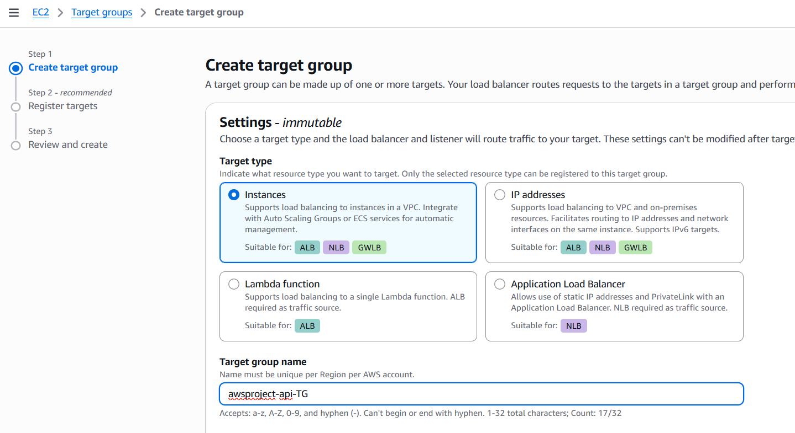
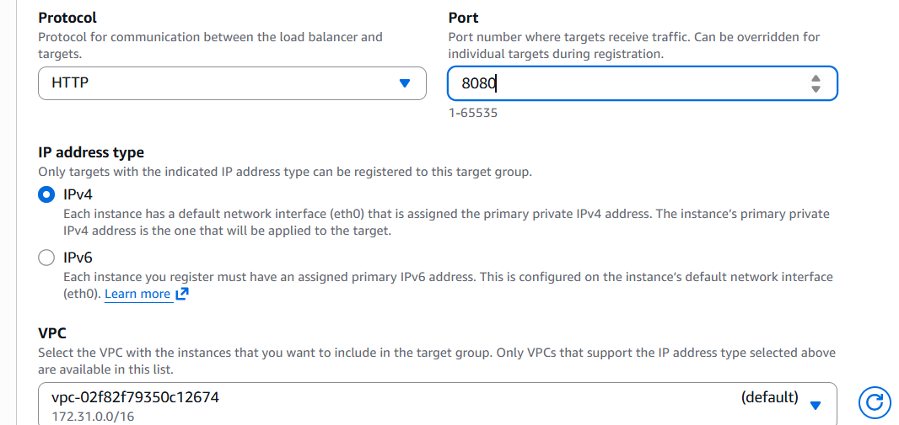
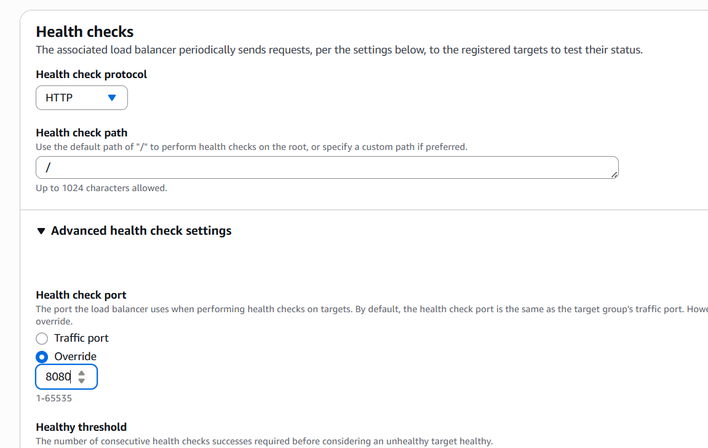
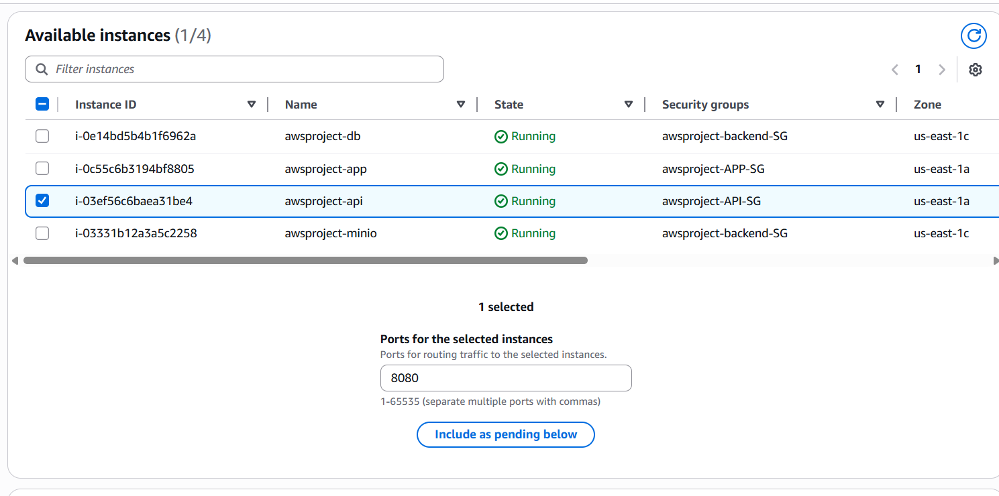
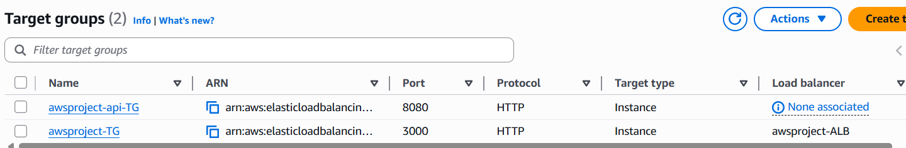

##### Create a load balancer

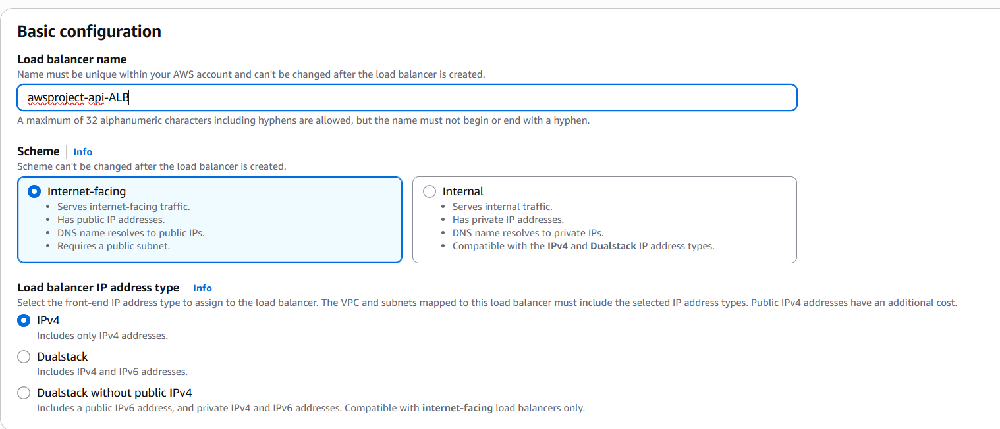
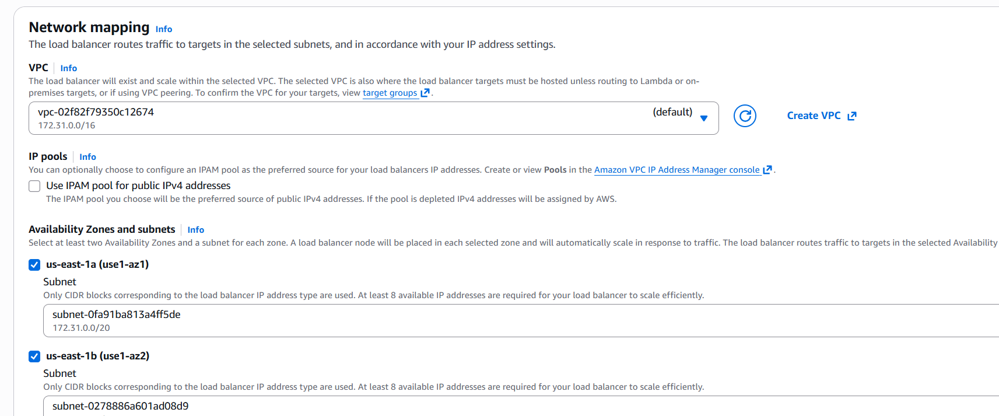
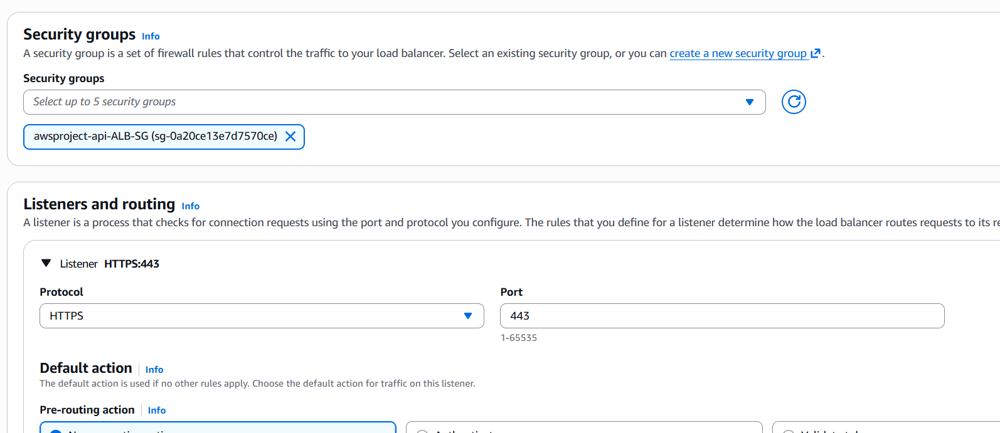
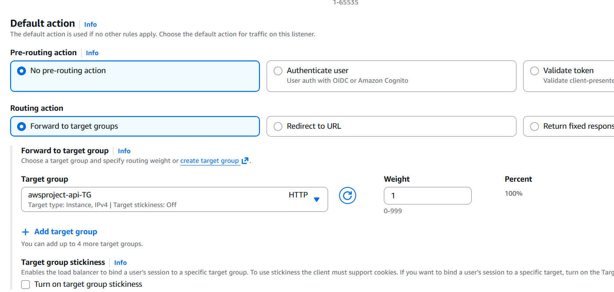
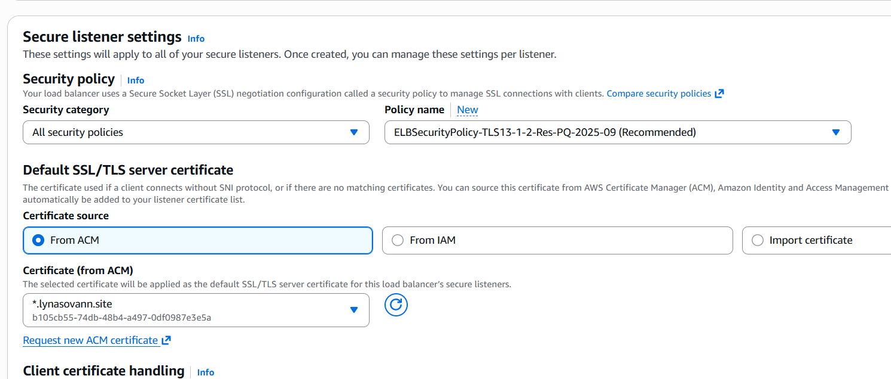
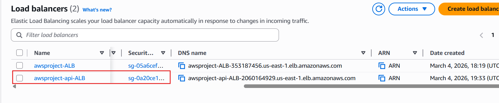

##### Configure domain name


**awsproject-app**

- Name: awsproject-app
- Key Pair: awsproject-prod-key.pem
- Security Group: awsproject-app-SG
- API: Ubuntu Server 24.04, t3.micro
- user data: **./userdata/nextjs.sh**
- After launch an instance
  1. ssh to the instance

```bash
ssh -i .\awsproject-prod-key.pem ubuntu@100.54.10.22
```

2. Switch to root user

```bash
sudo -i
```

3. Clone the code (/opt/frontend)

```bash
git clone https://github.com/LynaSovann/frontend-for-testing.git .
```

4. Change the .env

```bash
NEXT_PUBLIC_API_URL=https://api.lynasovann.site
```

5. Install dependencies and build the code

```bash
/usr/local/node/bin/yarn
/usr/local/node/bin/yarn build
```

6. Restart the service

```bash
systemctl restart frontend
```

7. Check status

```bash
systemctl status frontend
```

### Create an application Target Group

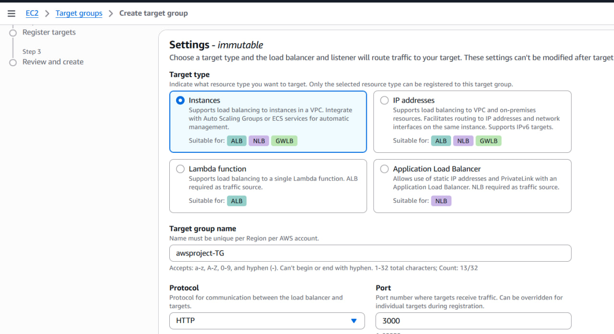
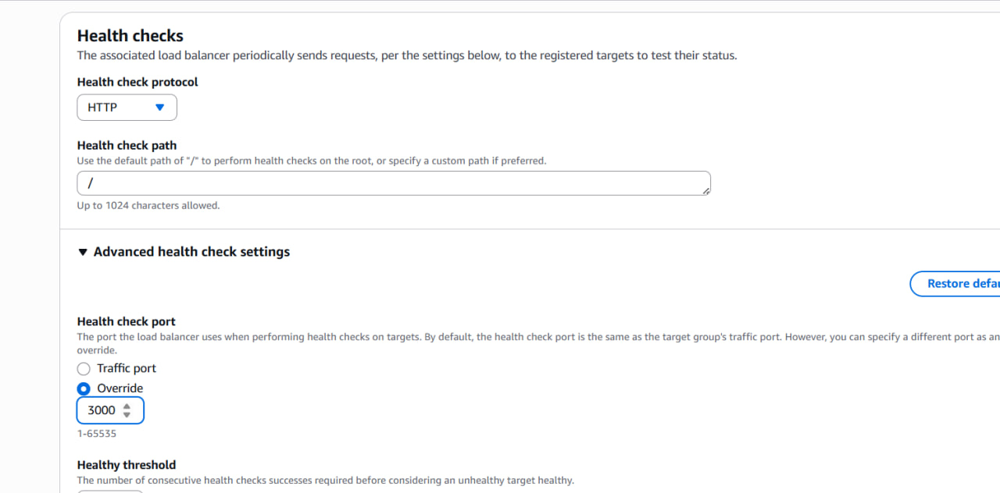
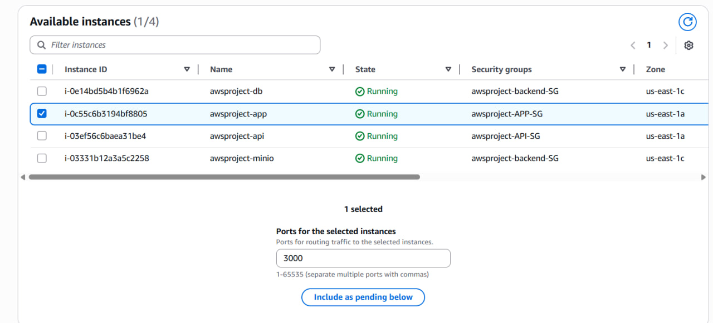
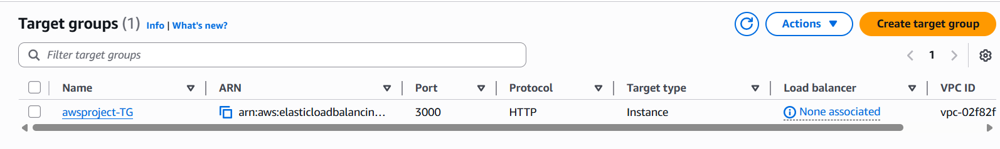

### Create Application Load Balancer

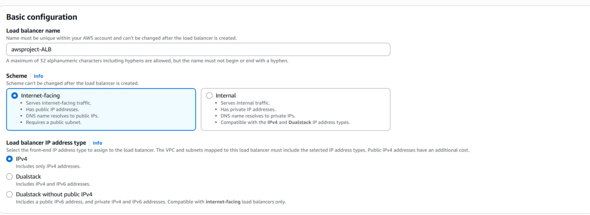
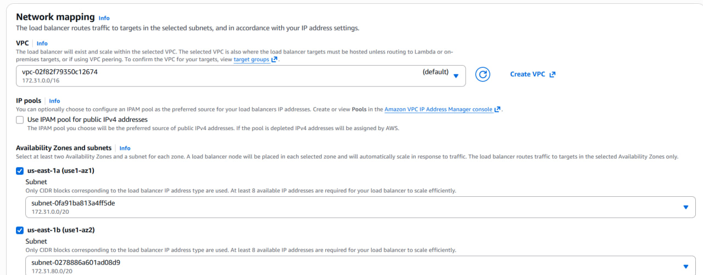
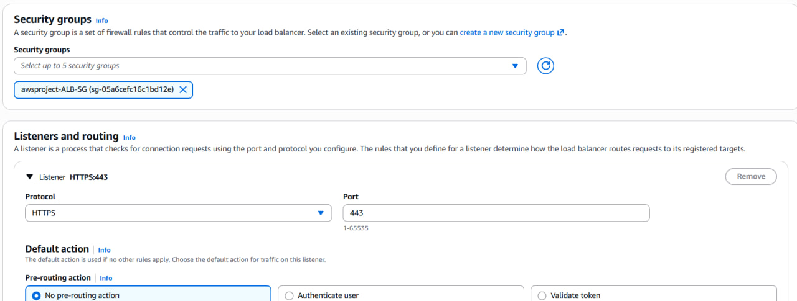
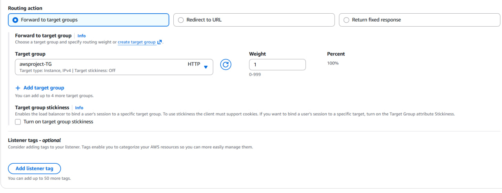
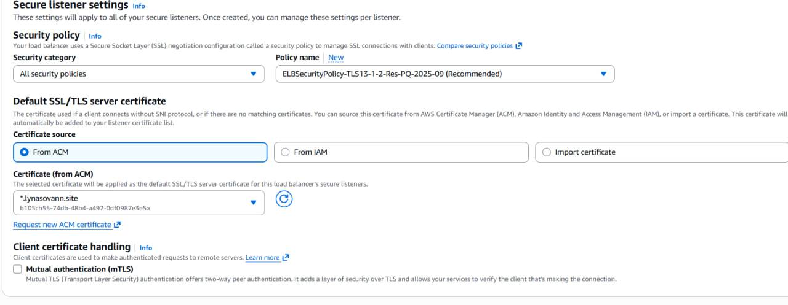
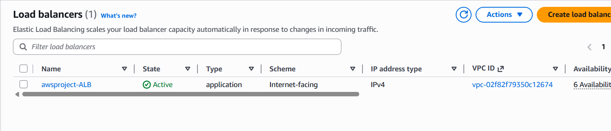

### Configure domain name


### Create Auto Scaling Group

// In progress

##### Result

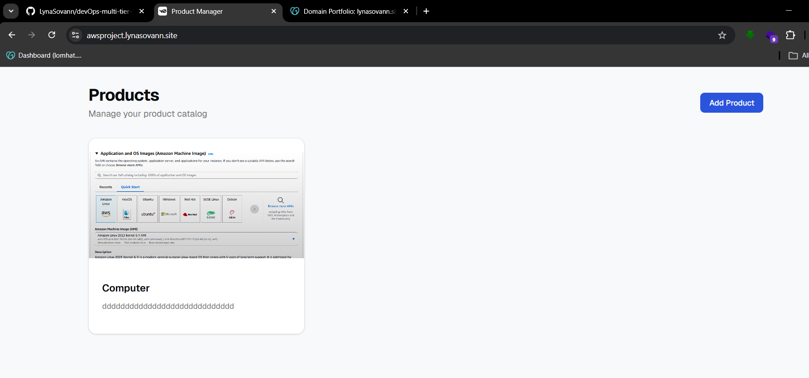
